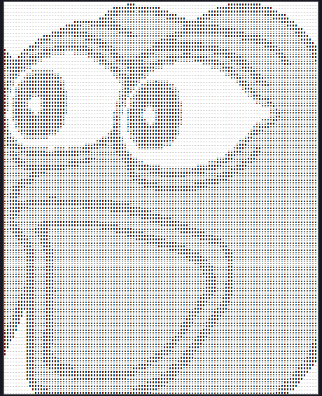

# ASCII Renderer
A renderer to convert normal images into ASCII art.

<table>
  <tr>
    <td>
      
    </td>
    <td>
      

        The demo is available for use in the <code>index.html</code> file. 
         
         
        It provides basic controls for uploading and converting images to ASCII art.
         
         
        The <code>ASCIIRenderer.js</code> has more features than are displayed in the
         
        basic controls of the demo though, so I'd recommend taking a look!
         
         
        This project isn't 100% polished; it is more of a proof-of-concept 
         
        rather than a deployable tool. 
        Though, functionality-wise it is essentially complete.
      

    </td>
  </tr>
</table>

  
  

## Usage
Either open the `index.html` file in your browser, visit `https://nethe550.github.io/ascii-renderer`, or import `ASCIIRenderer.js` into a webpage of your own.

## Character Palettes
Character palettes are structured like an array of strings.

For example, a character palette might look like `[ '@', '#', ... '.' ]`.

Also, images are best viewed in a monospace font, to keep all of the characters aligned.

### Adding a Custom Character Palette
To add a custom character palette to the renderer, simply create a new instance of a renderer like so: 

`const renderer = new ASCIIRenderer();`, 

and then add the new character array by placing it within the renderer, like so: 

`renderer.Palettes["palette_name_here"] = yourNewPalette;`.

## Notes
Character palettes are sorted by decreasing "density", i.e. the amount of pixels a character takes up in relation to the total character size.

If you are confused about how to operate the renderer, see `index.html` and `ASCIIRenderer.js` for an example. The code is well-documented with js-doc.
